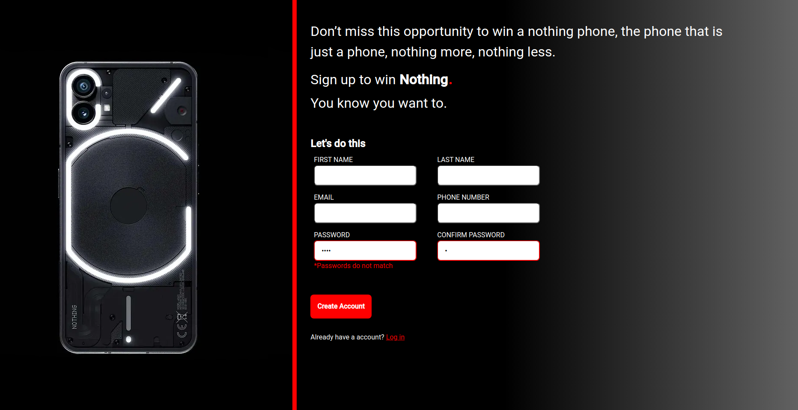

# Sign-up Form

**Link to project**: https://brianbud.github.io/sign-up-form/

## About Project

A simple signup form to practice about basic forms and form validation.

**Tech used:** HTML, CSS, Javascript

## Lessons Learnt

- learnt about the different types of buttons and how to connect a form to a btn outside the form.
- why and how to use preventDefault() method.
- how to create custom validations like confirming that passwords match.

## Things to add

- I still want to add more form validation using regex
- make the layout mobile friendly
- refactor my css.
